# 📈 Time Series Analysis and Visualization App

This Streamlit application provides interactive visualizations and analysis tools for time series data using ARIMA modeling, seasonal decomposition, and various plotting libraries.(Based on WalmartSales Analaysis)

## 🛠️ Requirements

Make sure you have **Python 3.7 or higher** installed. You can create a virtual environment if needed.

### 📦 Required Python Libraries

Install the following libraries using `pip`:

```bash
pip install streamlit pandas numpy plotly matplotlib statsmodels seaborn Pillow
```

### 🧩 Optional (Recommended for Jupyter Notebook Users)

If you're working in a Jupyter environment, you may also install:

```bash
pip install jupyterlab
```

## 🧪 Included Libraries

This script uses the following libraries:

* `streamlit` – For building interactive web apps
* `pandas` – For data manipulation
* `numpy` – For numerical computations
* `plotly.express`, `plotly.graph_objects`, `plotly.subplots` – For interactive plotting
* `matplotlib.pyplot` – For static plots
* `statsmodels` – For ARIMA modeling and seasonal decomposition
* `seaborn` – For statistical plotting
* `io`, `base64` – For in-memory file and image handling
* `PIL` – Python Imaging Library (Pillow)
* `datetime` – For working with time and dates
* `warnings` – For managing warning messages

## 🚀 Running the App

Once all libraries are installed, you can run the Streamlit app using:

```bash
streamlit run app.py
```


---
- Due to all dependencies, it may take some time to run , so wait patiently...
#### If in case any error occurs , contact me theraghavjuneja@gmail.com,
- Open for gigs for full-stack, Computer Vision and AI-ML Projects

# Screenshots

Below are the screenshots showing the features and workflow of the project.

### Screenshot Gallery

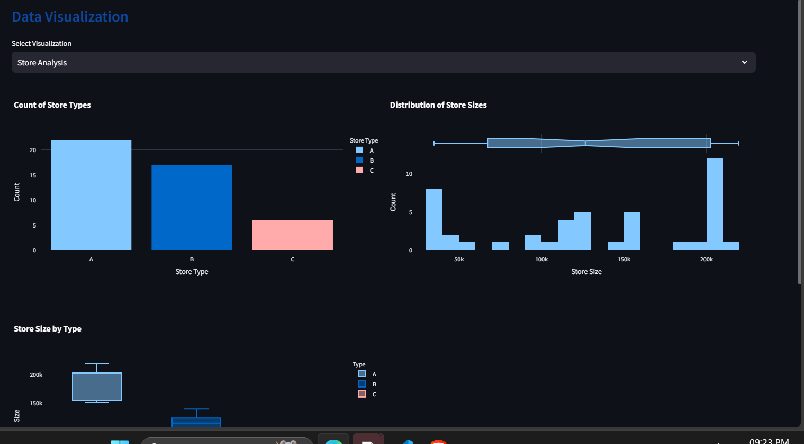
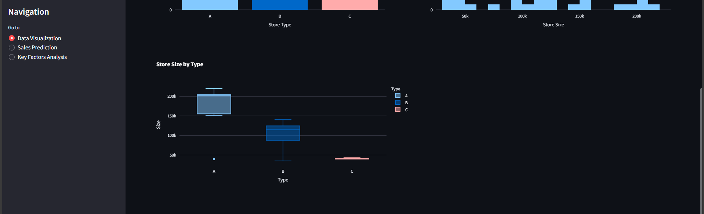
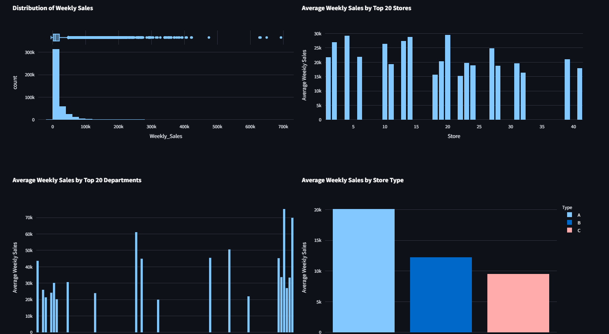
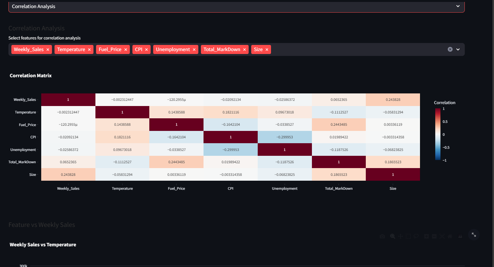
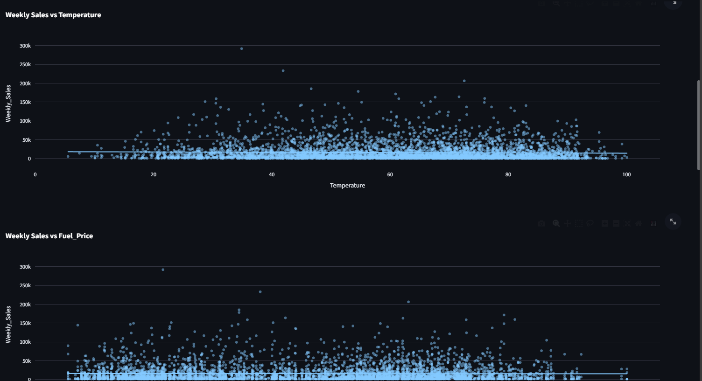
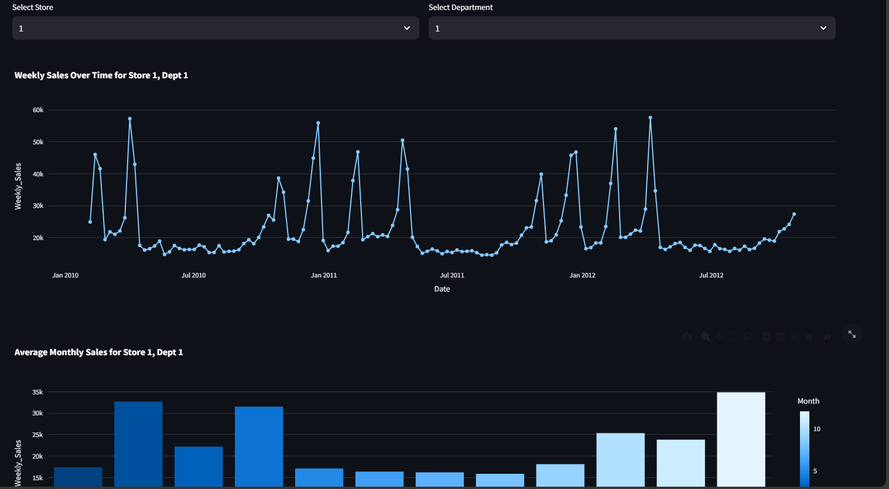
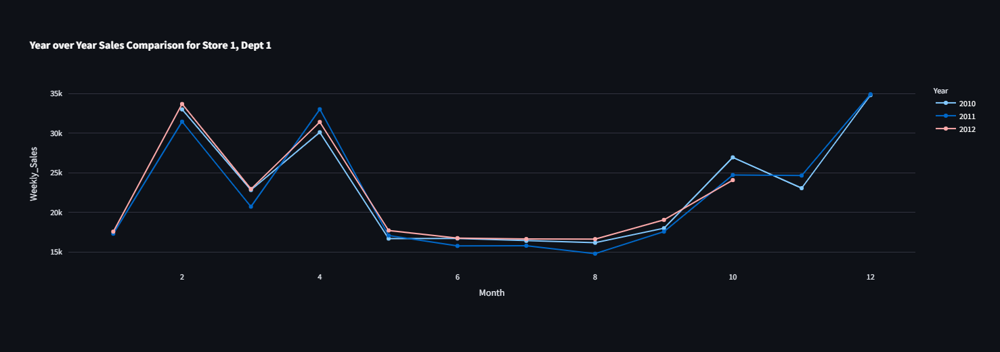
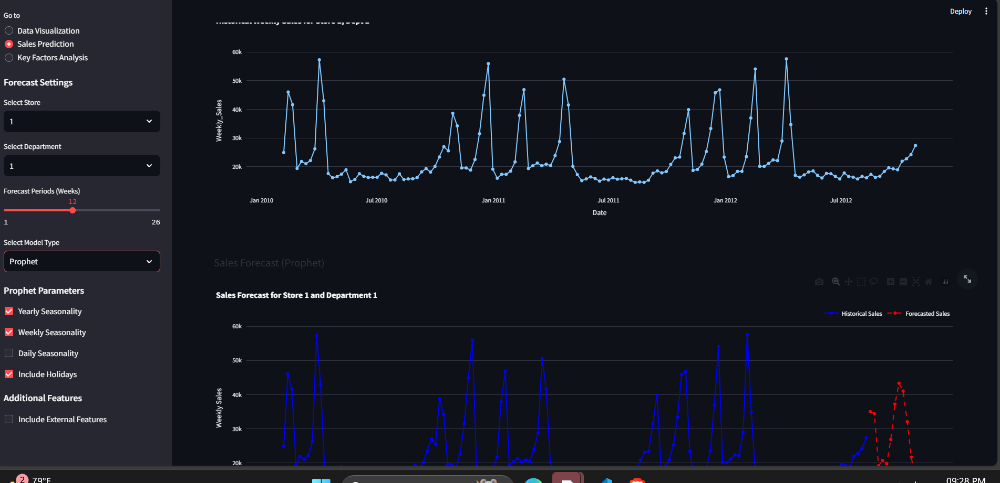
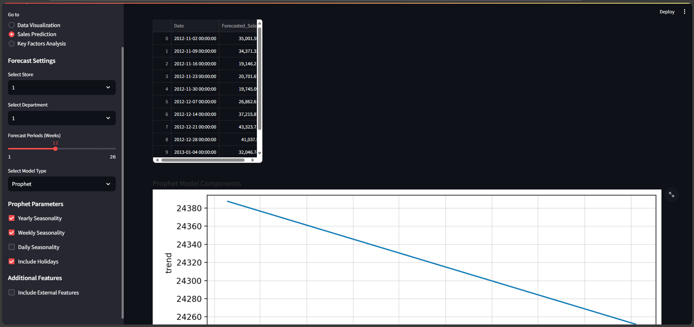
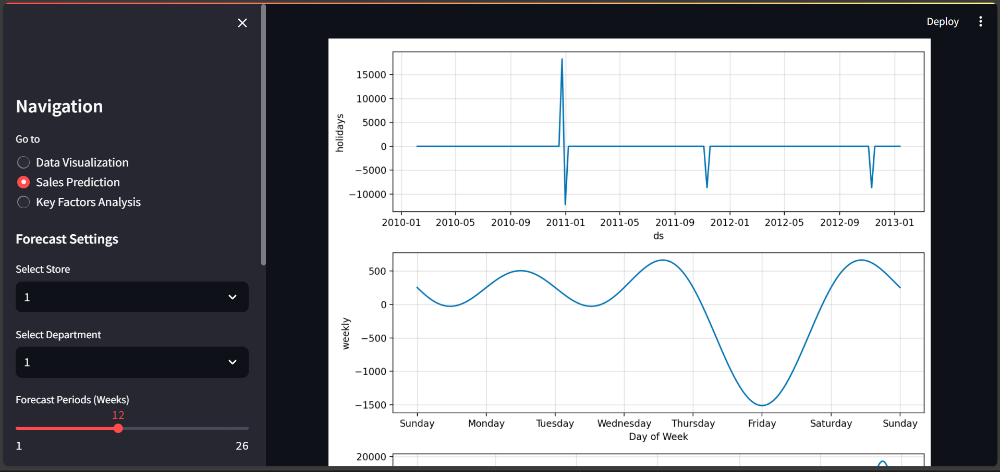
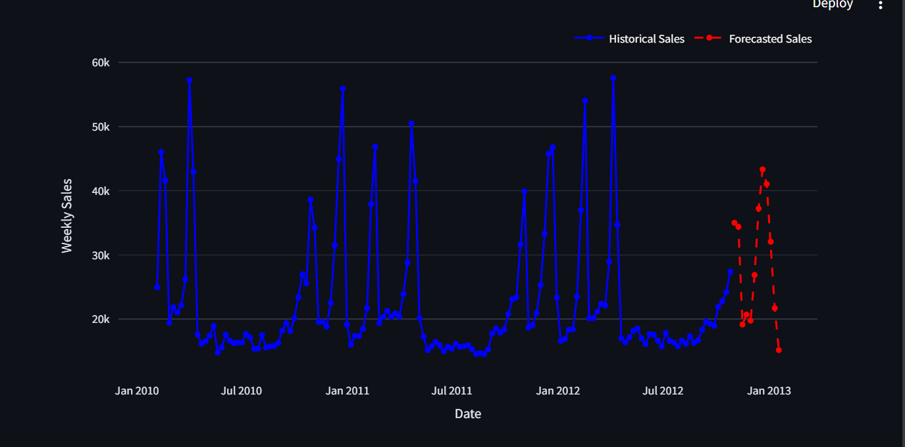
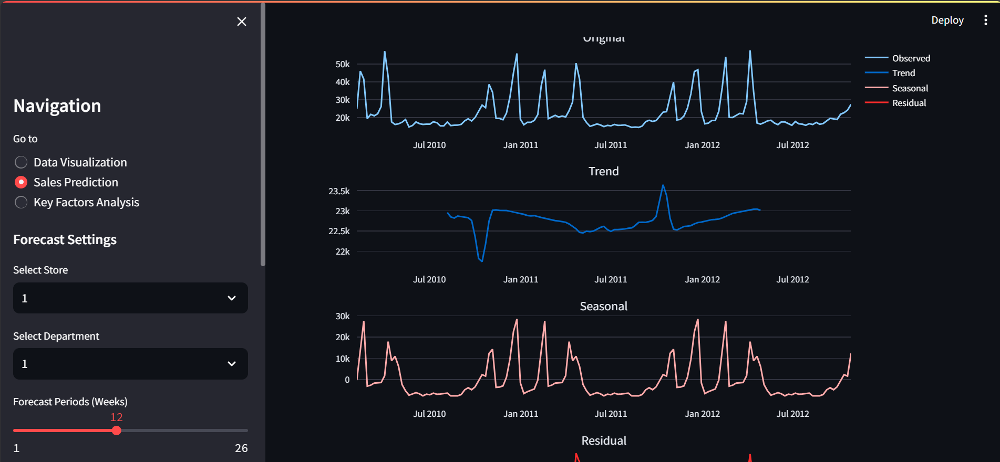
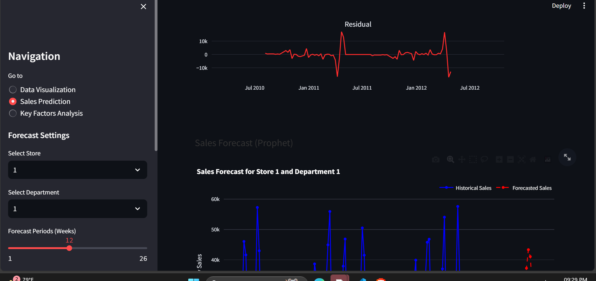
